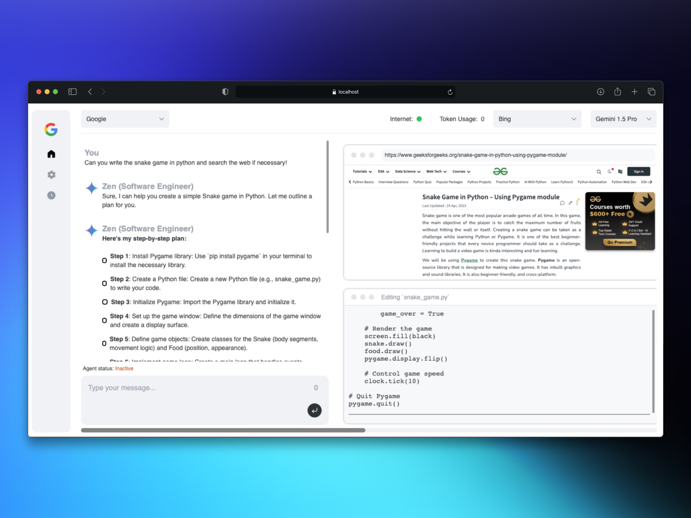

<p align="center">
  
</p>

<h1 align="center"> 🧘 Google Zen (Twins of Gemini) - <i> AI Software Engineer </i>🦾</h1>

<i> Gemini API dev competition.</i>



> [!IMPORTANT]  
> This project is currently in a very early development/experimental stage. There are a lot of unimplemented/broken features at the moment. Contributions are welcome to help out with the progress!

## Table of Contents

- [Table of Contents](#table-of-contents)
- [About](#about)
- [Demo](#demo)
- [Key Features](#key-features)
- [System Architecture](#system-architecture)
- [Getting Started](#getting-started)
  - [Requirements](#requirements)
  - [Installation](#installation)
  - [how to use](#how-to-use)
- [Configuration](#configuration)
- [Contributing](#contributing)
- [Help and Support](#help-and-support)
- [License](#license)
- [Star History](#star-history)

## About

 Zen is an advanced AI software engineer that can understand high-level human instructions, break them down into steps, research relevant information, and write code to achieve the given objective.  utilizes large language models, planning and reasoning algorithms, and web browsing abilities to intelligently develop software. Zen aims to revolutionize the way we build software by providing an AI pair programmer who can take on complex coding tasks with minimal human guidance. Whether you need to create a new feature, fix a bug, or develop an entire project from scratch,  is here to assist you.

> [!NOTE]
>  is modeled after [Devin](https://www.cognition-labs.com/introducing-devin) by Cognition AI. This project aims to be an open-source alternative to Devin with an "overly ambitious" goal to meet the same score as Devin in the [SWE-bench](https://www.swebench.com/) Benchmarks... and eventually beat it?

## Demo [Click on the image!!!]

[](https://www.youtube.com/watch?v=8v9ovFEuXho)


## Key Features

- 🤖 Supports  **Gemini**
- 🧠 Advanced AI planning and reasoning capabilities
- 🔍 Contextual keyword extraction for focused research
- 🌐 Seamless web browsing and information gathering
- 💻 Code writing in multiple programming languages
- 📊 Dynamic agent state tracking and visualization
- 💬 Natural language interaction via chat interface
- 📂 Project-based organization and management
- 🔌 Extensible architecture for adding new features and integrations

## System Architecture

Read [**README.md**](docs/architecture) for the detailed documentation.


## Getting Started

### Requirements
```
Version's requirements
  - Python >= 3.10 and < 3.12
  - NodeJs >= 18
  - bun
```

- Install uv - Python Package manager [download](https://github.com/astral-sh/uv)
- Install bun - JavaScript runtime [download](https://bun.sh/docs/installation)
- For API models, configure the API keys via setting page in UI.


### Installation

To install , follow these steps:

1. Clone the  repository:
   ```bash
   git clone https://github.com/PrateekJannu/Zen.git
   ```
2. Navigate to the project directory:
   ```bash
   cd Zen
   ```
3. Create a virtual environment and install the required dependencies (you can use any virtual environment manager):
   ```bash
   pip install -r requirements.txt
   ```
4. Install the playwright for browsering capabilities:
   ```bash
   playwright install --with-deps # installs browsers in playwright (and their deps) if required
   ```
5. Start the  server:
   ```bash
   python zen.py
   ```
6. if everything is working fine, you see the following output:
   ```bash
   root: INFO   : Zen is up and running!
   ```
7. Now, for frontend, open a new terminal and navigate to the `ui` directory:
   ```bash
   cd ui/
   npm install
   npm run start
   ```
8. Access the  web interface by opening a browser and navigating to `http://127.0.0.1:3001`

### how to use

To start using , follow these steps:

1. Open the  web interface in your browser.
2. To create a project, click on 'select project' and then click on 'new project'.
3. Select the search engine and model configuration for your project.
4. In the chat interface, provide a high-level objective or task description for  to work on.
5.  will process your request, break it down into steps, and start working on the task.
6. Monitor 's progress, view generated code, and provide additional guidance or feedback as needed.
7. Once  completes the task, review the generated code and project files.
8. Iterate and refine the project as desired by providing further instructions or modifications.

## Configuration

 requires certain configuration settings and API keys to function properly:

when you first time run , it will create a `config.toml` file for you in the root directory. You can configure the following settings in the settings page via UI:

- API KEYS
   - `BING`: Your Bing Search API key for web searching capabilities.
   - `GOOGLE_SEARCH`: Your Google Search API key for web searching capabilities.
   - `GOOGLE_SEARCH_ENGINE_ID`: Your Google Search Engine ID for web searching using Google.
   - `GEMINI`: Your Gemini API key for accessing Gemini models.
   - `NETLIFY`: Your Netlify API key for deploying and managing web projects.

- API_ENDPOINTS
   - `BING`: The Bing API endpoint for web searching.
   - `GOOGLE`: The Google API endpoint for web searching.

Make sure to keep your API keys secure and do not share them publicly.

# Inspired by Devin and Devika
## License

Zen is released under the [MIT License](https://opensource.org/licenses/MIT) similar to Devika . See the `LICENSE` file for more information.

---

We hope you find  to be a valuable tool in your software development journey. If you have any questions, feedback, or suggestions, please don't hesitate to reach out. Happy coding with !
